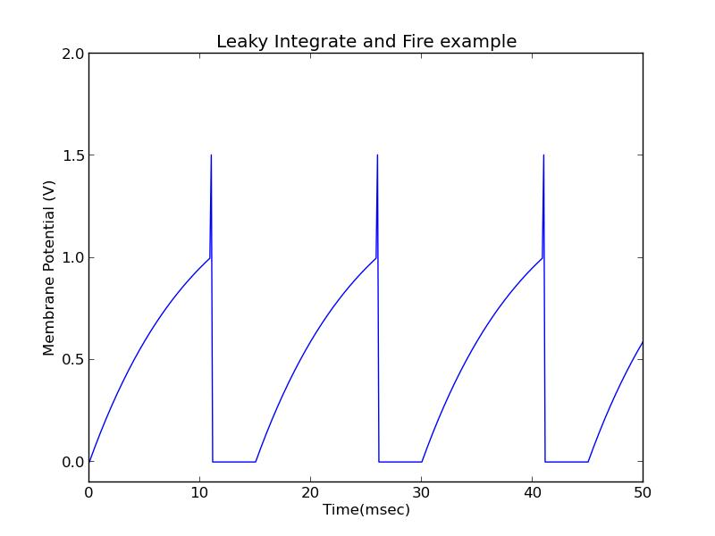

'Leaky Integrate and Fire' Model of a Neuron Signal
==========================================================================

'Leaky Integrate and Fire' is a simple model (differential equation) of
voltage spikes (called action potentials) in a Neuron cell. These voltage spikes
are voltage differences across the inside of the cell's membrane and outside of it.
Action potentials propagate down long tendrils of the neuron cell called *axons*
until they reach another neuron, where that neuron gets stimulated and generates
it's own action potentials (voltage spikes). It's the stuff thoughts are made of.



Reference
=========
I followed [this article](http://www.neurdon.com/2011/01/19/neural-modeling-with-python-part-1/).
It goes into more detail.

Equation to Code
========
The model is a single differential equation that defines how the voltage changes over time.
The voltage function that satisfies the differential equation spikes periodically.

The equation rendered in beautiful ASCII is
```
dV/dt = (1/tau_m) * (I*Rm - V)
```

You translate the differentials in that equation into code like this:
```python
dV = V[i] - V[i-1] # 'final minus initial'

# any small number. the smaller the better but sometimes there's barely a difference once you get small enough
dt = 0.125 # arbitrary
```

And then your equation translates like this
```python
==> dV/dt = (1/tau_m) * (I*Rm - V)
==> (V[i] - V[i-1])/dt = (1/tau_m) * (I*Rm - V[i-1])
==> V[i] = V[i-1] + dt * (1/tau_m) * (I*Rm - V[i-1])
```

Pick a starting value for `V[0]` (like 0), create a timeline with intervals of size `dt`
and then calculate the values of `V[]` for each point in time! Then you plot that shiz or use it for a nice animation

```python
import numpy

timeLine = numpy.arange(0, 50, dt)
V = numpy.zeros(len(timeLine)) # [0, 0, 0, 0...]

for i, t in enumerate(timeLine):
    if i > 0:
        V[i] = ...
```

That's called integration, because it integrates all the _changes_ in the Voltage into the actual Voltage

I don't get it
==============

* I don't get why the model repeats/oscillates with multiple spikes
* I don't get where the numbers come from
* I don't get where the differential equation comes from, or how you go from a 'picture' of the neuron to an equation

Things you can do with the solution
===============================
Once you've integrated/solved the differential equation you can

* Plot it
* Everytime you calculate a new point output a frame of the plot so far. When you're done put em all together and make a gif or something
* Use the equation in a webgl shader to make pretty things with lights. Maybe visualize neurons and use the solution to protray
signals
* Write a simulation with tons of neurons where signals are sent to each other according to the solution. Maybe make it so that one neuron starts with this signal, and then it propogates to all the neurons it's connected to, and then to all the neurons that those are connected to and on and on and on
* Make a game with it. "Yo this game's physics rock!" they'll say
* Modulate an audio signal with the solution (hearing your solution seems funner than looking at a plot of it)


